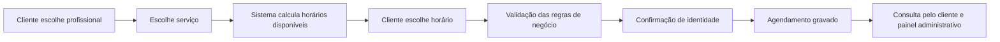

# É Só Marcar — Case técnico

Case técnico de um **SaaS de agendamento online em operação real**, desenvolvido para negócios que atendem com hora marcada.

> Este repositório apresenta arquitetura, decisões técnicas, regras de negócio e aprendizados do projeto. O código-fonte de produção permanece privado para não expor dados, credenciais ou estruturas sensíveis.

## O problema

Pequenos negócios que trabalham com agenda costumam depender de WhatsApp, papel ou controles manuais para organizar horários. Isso gera conflitos, retrabalho e dificuldade para o cliente consultar ou cancelar um agendamento.

O **É Só Marcar** foi criado para centralizar esse fluxo e permitir que o próprio cliente escolha profissional, serviço, data e horário disponível pela internet.

**Produto em uso:** https://esomarcar.com.br

## O que o sistema faz

### Para o cliente

- escolha de profissional, serviço, data e horário;
- validação de disponibilidade antes da confirmação;
- identificação por telefone;
- confirmação de acesso por SMS;
- consulta de agendamentos futuros;
- cancelamento dentro das regras configuradas.

### Para o negócio

- agenda do dia e agenda futura;
- cadastro de profissionais e serviços;
- duração de serviço por profissional;
- horário padrão de atendimento;
- datas abertas e horários bloqueados;
- criação manual de agendamentos;
- usuários administrativos;
- regras de antecedência e janela máxima de agendamento.

## Stack e práticas utilizadas

### V1 — produção

- **PHP**
- **WordPress** como base de integração e operação
- **MySQL / SQL**
- **JavaScript, HTML e CSS**
- integração com serviço externo de **SMS**
- autenticação e controle de acesso
- regras de negócio e validações no backend
- ambientes separados para **teste e produção**
- backups antes de alterações relevantes
- debugging e validação manual antes do deploy

### V2 — em desenvolvimento

A nova geração está sendo construída em **Laravel**, com arquitetura **SaaS multi-tenant**, preparada para atender diferentes negócios sem misturar seus dados e configurações.

Objetivos principais da V2:

- separar claramente dados por tenant;
- reduzir acoplamento entre regras de negócio e interface;
- facilitar testes e manutenção;
- preparar a plataforma para novos segmentos;
- deixar espaço arquitetural para módulos futuros, como financeiro e estoque.

## Regras de negócio relevantes

Algumas regras que precisaram ser tratadas no produto:

- slots base de 20 minutos;
- duração variável conforme profissional e serviço;
- antecedência mínima para novos agendamentos;
- limite de dias disponíveis no futuro;
- horários e datas bloqueados;
- prevenção de conflitos de agenda;
- limites de ações por telefone e sessão;
- cancelamento permitido até um período configurável antes do horário.

Essas regras são aplicadas no backend e validadas novamente antes de confirmar o agendamento.

## Autenticação e confirmação por SMS

Um dos fluxos implementados foi a confirmação de identidade por SMS.

O fluxo utiliza:

1. geração de código temporário;
2. armazenamento seguro por hash;
3. expiração do código;
4. limite de tentativas;
5. controle de reenvio e rate limiting;
6. criação de um token persistente para dispositivos já validados.

A implementação foi feita primeiro no ambiente de teste e publicada em produção somente após validação do fluxo completo.

## Fluxo simplificado de agendamento

## Estratégia de desenvolvimento e deploy

O projeto é mantido com uma rotina simples, mas controlada:

1. entender o problema ou regra solicitada;
2. analisar impacto no fluxo existente;
3. implementar no ambiente de teste;
4. validar cenários principais e possíveis regressões;
5. realizar backup quando necessário;
6. publicar em produção;
7. verificar o comportamento após o deploy.

Essa rotina foi adotada porque o sistema já possui usuários reais e alterações não podem interromper a operação existente.

## Exemplos de problemas reais resolvidos

### Clareza no acesso aos agendamentos

Usuários tinham dificuldade para localizar o código necessário para consultar seus agendamentos. A investigação mostrou que o problema não era apenas técnico, mas também de **UX e clareza do fluxo**.

A solução envolveu:

- reorganizar a forma de apresentação do código;
- dar mais destaque à informação;
- melhorar caminhos de recuperação;
- permitir compartilhamento das informações do agendamento;
- validar todo o fluxo novamente antes do deploy.

### Confirmação por SMS

Diferentes serviços de SMS foram avaliados antes da escolha da integração utilizada em produção. O fluxo também precisou considerar tempo de entrega, expiração de código, tentativas inválidas e recuperação de acesso.

Esse trabalho envolveu integração externa, tratamento de falhas e validação de comportamento em ambiente real.

## O que este projeto demonstra

O objetivo deste case não é apenas mostrar uma interface pronta. Ele representa experiência prática com:

- desenvolvimento backend;
- SQL e persistência de dados;
- APIs e integrações externas;
- autenticação e segurança de fluxo;
- regras de negócio;
- debugging;
- testes funcionais e validação de regressão;
- deploy e manutenção de sistema em produção;
- análise de problemas a partir da experiência real do usuário.

## Uso de IA no desenvolvimento

Ferramentas de IA fazem parte do meu fluxo de trabalho para análise, implementação, revisão, debugging e pesquisa técnica.

O uso não substitui validação: alterações são analisadas, testadas e verificadas antes de chegar à produção.

## Próximos passos do projeto

- evolução da V2 em Laravel;
- consolidação da arquitetura multi-tenant;
- melhoria da cobertura de testes;
- evolução dos fluxos de reagendamento;
- preparação para expansão para outros segmentos;
- arquitetura preparada para módulos futuros de financeiro e estoque.

## Sobre mim

Sou **Rodrigo Bueno Oliveira**, formado em Administração com Ênfase em Comércio Exterior e com mais de 20 anos de experiência em gestão e operação de empresas. Hoje aplico essa visão de processos e negócio ao desenvolvimento de software.

- GitHub: https://github.com/rododigobueno
- Portfólio: https://adsqueconverte.com.br
- LinkedIn: https://www.linkedin.com/in/rodrigo-bueno-oliveira/
